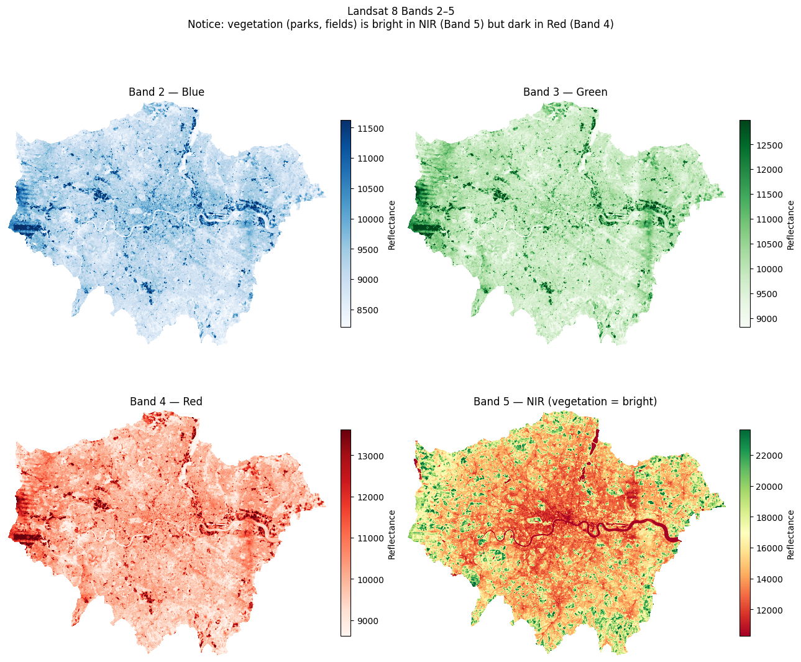
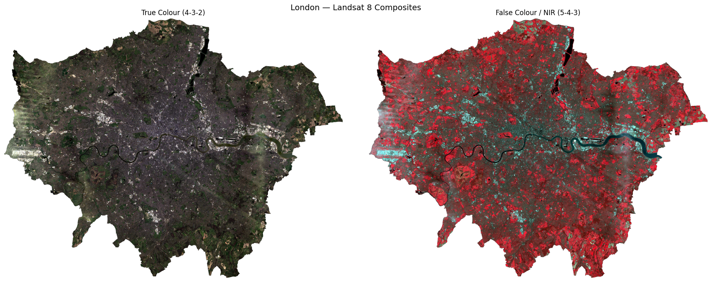
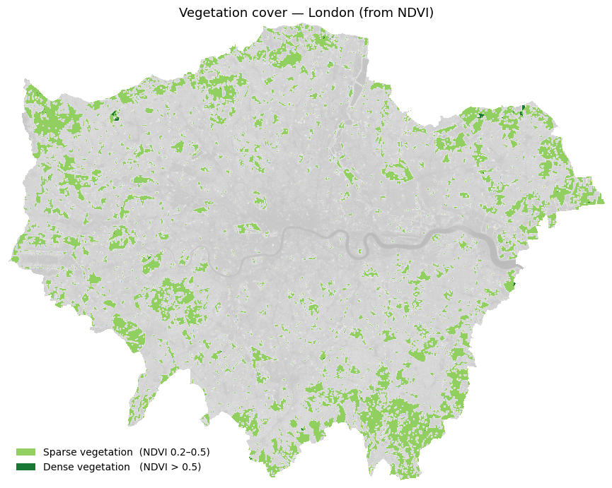
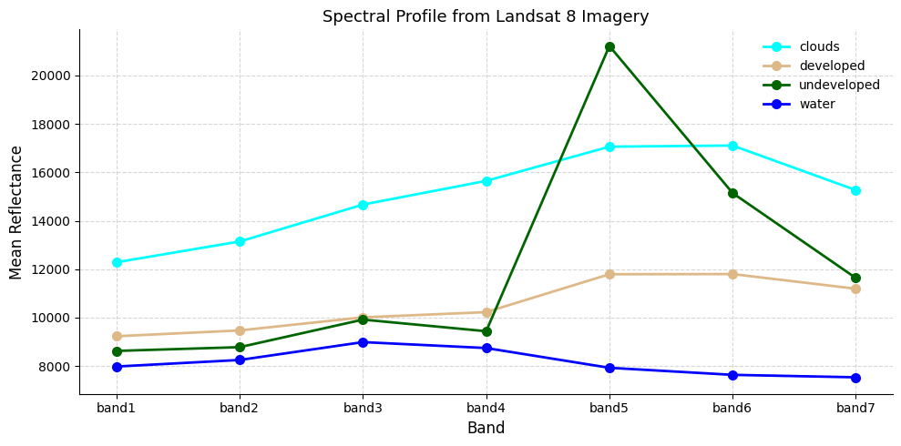
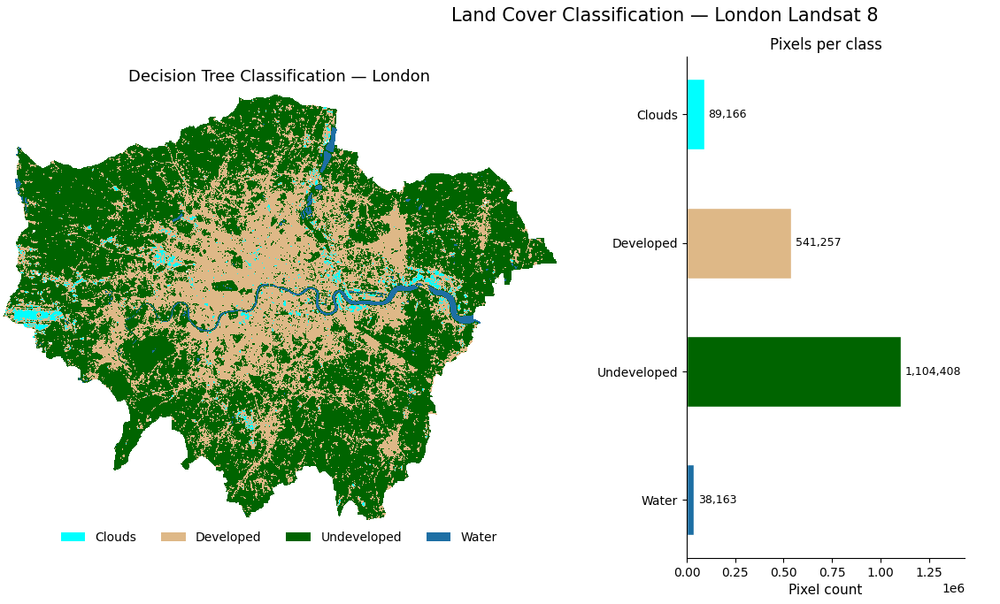

# From Pixels to Patterns

> *Reading London from Space.*

{width="160"} {width="180"}

**Authors** Elisabetta Pietrostefani, with the Geographic Data Science Lab and Imago

**Institution** Geographic Data Science Lab, University of Liverpool

**Source** Interactive adaptation of a teaching lab on satellite image classification, prepared for the Applicant Discovery Day workshop *Understanding our world from space*.

------------------------------------------------------------------------

## What is this story about?

```{=html}
<style>
  .hero-scene {
    position: relative;
    width: 100%;
    max-width: 720px;
    margin: 1.5rem 0 2rem;
    background: linear-gradient(180deg, #E2E5F3 0%, #FFFFFF 100%);
    border-radius: 8px;
    overflow: hidden;
    font-family: 'Figtree', sans-serif;
  }
  .hero-scene svg { display: block; width: 100%; height: auto; }
  @keyframes sat-orbit {
    0%   { transform: translateX(-10%); }
    50%  { transform: translateX(110%); }
    100% { transform: translateX(-10%); }
  }
  @keyframes beam-pulse {
    0%, 100% { opacity: 0.15; }
    50%      { opacity: 0.55; }
  }
  .hero-scene .satellite { animation: sat-orbit 18s linear infinite; transform-origin: center; }
  .hero-scene .beam      { animation: beam-pulse 3.5s ease-in-out infinite; transform-origin: top center; }
  @media (prefers-reduced-motion: reduce) {
    .hero-scene .satellite { animation: none; transform: translateX(40%); }
    .hero-scene .beam      { animation: none; opacity: 0.35; }
  }

  .hero-stats {
    display: grid;
    grid-template-columns: repeat(auto-fit, minmax(180px, 1fr));
    gap: 12px;
    max-width: 720px;
    margin: 0 0 2rem;
    font-family: 'Figtree', sans-serif;
  }
  .hero-stats .stat {
    background: #FFFFFF;
    border: 1px solid #E2E5F3;
    border-radius: 8px;
    padding: 1rem 1.1rem;
  }
  .hero-stats .stat-num {
    font-size: 2rem;
    font-weight: 600;
    color: #24226F;
    line-height: 1;
    font-variant-numeric: tabular-nums;
  }
  .hero-stats .stat-unit {
    font-size: 1.2rem;
    font-weight: 500;
    color: #FF8F42;
    margin-left: 2px;
  }
  .hero-stats .stat-label {
    font-size: 0.85rem;
    color: #4a4a49;
    margin-top: 0.4rem;
    line-height: 1.3;
  }

  .roadmap {
    display: grid;
    grid-template-columns: repeat(auto-fit, minmax(220px, 1fr));
    gap: 12px;
    max-width: 720px;
    margin: 1.5rem 0 2rem;
    font-family: 'Figtree', sans-serif;
  }
  .roadmap a.roadmap-card {
    display: block;
    padding: 1rem 1.1rem;
    background: #FFFFFF;
    border: 1px solid #E2E5F3;
    border-left: 4px solid #24226F;
    border-radius: 4px 8px 8px 4px;
    text-decoration: none;
    color: #4a4a49;
    transition: border-left-color 0.15s ease, background 0.15s ease, transform 0.15s ease;
  }
  .roadmap a.roadmap-card:hover,
  .roadmap a.roadmap-card:focus-visible {
    border-left-color: #FF8F42;
    background: #E2E5F3;
    transform: translateX(2px);
    outline: none;
  }
  .roadmap .step-num {
    font-size: 0.75rem;
    font-weight: 500;
    color: #8C91A8;
    letter-spacing: 0.05em;
    text-transform: uppercase;
  }
  .roadmap .step-title {
    font-weight: 500;
    color: #24226F;
    font-size: 1rem;
    margin: 0.3rem 0 0.4rem;
  }
  .roadmap .step-blurb {
    font-size: 0.88rem;
    line-height: 1.45;
    color: #4a4a49;
  }
</style>

<div class="hero-scene" role="img" aria-label="Illustration of a Landsat satellite passing over London">
  <svg viewBox="0 0 720 260" xmlns="http://www.w3.org/2000/svg">
    <!-- sky already via gradient background; stars -->
    <circle cx="80"  cy="40" r="1.2" fill="#24226F" opacity="0.35"/>
    <circle cx="230" cy="25" r="1"   fill="#24226F" opacity="0.45"/>
    <circle cx="400" cy="55" r="1.4" fill="#24226F" opacity="0.3"/>
    <circle cx="560" cy="30" r="1"   fill="#24226F" opacity="0.4"/>
    <circle cx="650" cy="60" r="1.2" fill="#24226F" opacity="0.35"/>

    <!-- ground: stylised London silhouette -->
    <path d="M0,220 L0,200 C80,190 140,205 200,195 C260,185 290,200 340,192 C390,184 430,205 500,200 C560,195 620,188 720,200 L720,260 L0,260 Z"
          fill="#B8BCD1" opacity="0.5"/>
    <path d="M0,215 L0,260 L720,260 L720,210 C620,218 560,205 500,212 C430,220 390,210 340,215 C290,220 260,208 200,215 C140,222 80,212 0,215 Z"
          fill="#24226F" opacity="0.15"/>

    <!-- Thames -->
    <path d="M40,235 Q120,228 200,234 T360,232 T540,234 T720,230"
          stroke="#1877CF" stroke-width="2.5" fill="none" opacity="0.7" stroke-linecap="round"/>

    <!-- London skyline silhouettes -->
    <g fill="#24226F" opacity="0.55">
      <rect x="250" y="205" width="8"  height="22"/>
      <rect x="262" y="198" width="10" height="29"/>
      <rect x="276" y="210" width="6"  height="17"/>
      <rect x="296" y="195" width="12" height="32"/>
      <rect x="312" y="202" width="7"  height="25"/>
      <polygon points="330,227 338,200 346,227"/>
      <rect x="355" y="208" width="9"  height="19"/>
      <rect x="370" y="192" width="14" height="35"/>
      <rect x="390" y="203" width="8"  height="24"/>
      <rect x="402" y="210" width="6"  height="17"/>
      <rect x="418" y="198" width="10" height="29"/>
    </g>

    <!-- satellite + imaging beam (group animates across) -->
    <g class="satellite">
      <g transform="translate(0, 0)">
        <!-- imaging beam (cone from satellite down to ground) -->
        <polygon class="beam" points="80,70 60,210 100,210" fill="#FF8F42"/>

        <!-- satellite body -->
        <rect x="72" y="60" width="16" height="14" rx="2" fill="#24226F"/>
        <!-- solar panels -->
        <rect x="50" y="62" width="20" height="10" fill="#03CEA3"/>
        <rect x="90" y="62" width="20" height="10" fill="#03CEA3"/>
        <line x1="50" y1="67" x2="70" y2="67" stroke="#24226F" stroke-width="0.6"/>
        <line x1="90" y1="67" x2="110" y2="67" stroke="#24226F" stroke-width="0.6"/>
        <!-- sensor aperture -->
        <circle cx="80" cy="76" r="2.5" fill="#FF8F42"/>
      </g>
    </g>

    <!-- caption inside the SVG -->
    <text x="360" y="30" text-anchor="middle" font-family="Figtree, sans-serif" font-size="13" font-weight="500" fill="#24226F">
      Every 16 days, Landsat passes overhead
    </text>
    <text x="360" y="48" text-anchor="middle" font-family="Figtree, sans-serif" font-size="11" fill="#4a4a49">
      recording London in 11 wavelengths of light — most invisible to us
    </text>
  </svg>
</div>
```

Every sixteen days, a pair of NASA satellites called Landsat 8 and 9 pass over London, recording the city in eleven different wavelengths of light. Most of those wavelengths are invisible to us. Together, they contain far more information about the ground than any photograph.

```{=html}
<div class="hero-stats" role="group" aria-label="Key facts about Landsat imagery">
  <div class="stat">
    <div><span class="stat-num" data-count="11">0</span></div>
    <div class="stat-label">wavelengths of light captured per pass</div>
  </div>
  <div class="stat">
    <div><span class="stat-num" data-count="16">0</span><span class="stat-unit">&nbsp;days</span></div>
    <div class="stat-label">between each full pass over London</div>
  </div>
  <div class="stat">
    <div><span class="stat-num" data-count="30">0</span><span class="stat-unit">&nbsp;m</span></div>
    <div class="stat-label">the size of the square each pixel represents</div>
  </div>
  <div class="stat">
    <div><span class="stat-num" data-count="1972">0</span></div>
    <div class="stat-label">the year the Landsat archive began</div>
  </div>
</div>

<script>
(function () {
  var els = document.querySelectorAll(".hero-stats .stat-num");
  function animateCount(el) {
    var target = parseInt(el.getAttribute("data-count"), 10);
    var duration = 900;
    var start = performance.now();
    function tick(now) {
      var t = Math.min(1, (now - start) / duration);
      var eased = 1 - Math.pow(1 - t, 3);
      el.textContent = Math.round(eased * target).toLocaleString();
      if (t < 1) requestAnimationFrame(tick);
    }
    requestAnimationFrame(tick);
  }
  if ("IntersectionObserver" in window) {
    var obs = new IntersectionObserver(function (entries) {
      entries.forEach(function (e) {
        if (e.isIntersecting) {
          animateCount(e.target);
          obs.unobserve(e.target);
        }
      });
    }, { threshold: 0.4 });
    els.forEach(function (el) { obs.observe(el); });
  } else {
    els.forEach(animateCount);
  }
})();
</script>
```

This page walks through what geographic data scientists do with that information — how we take raw satellite pixels and turn them into a map that says, for every 30-metre square of the city: *water, park, building, or cloud*. It also points to where the field is heading next, with a new generation of models that try to *understand* landscapes rather than just classify them.

You won't see any code here. This is the story the analysis tells. If you come and study with us at Liverpool, you'll learn to write that code yourself — and to read its output critically, which matters just as much.

**The journey from pixels to patterns** — jump to any stage:

```{=html}
<nav class="roadmap" aria-label="Story roadmap">
  <a class="roadmap-card" href="#what-do-the-raw-satellite-bands-show">
    <div class="step-num">Step 1</div>
    <div class="step-title">The raw ingredients</div>
    <div class="step-blurb">Seven layers of reflectance data — most invisible to the eye.</div>
  </a>
  <a class="roadmap-card" href="#can-we-make-something-that-looks-like-a-photograph">
    <div class="step-num">Step 2</div>
    <div class="step-title">Making it look like London</div>
    <div class="step-blurb">Stacking bands into true-colour and false-colour views.</div>
  </a>
  <a class="roadmap-card" href="#where-is-the-greenery">
    <div class="step-num">Step 3</div>
    <div class="step-title">Finding the greenery</div>
    <div class="step-blurb">A single number per pixel that lights up every park.</div>
  </a>
  <a class="roadmap-card" href="#can-we-label-every-pixel-as-water-park-building-or-cloud">
    <div class="step-num">Step 4</div>
    <div class="step-title">Classifying every pixel</div>
    <div class="step-blurb">Training a machine to tell water from buildings from trees.</div>
  </a>
  <a class="roadmap-card" href="#which-band-did-the-most-work">
    <div class="step-num">Step 5</div>
    <div class="step-title">What did the work?</div>
    <div class="step-blurb">Which bands carried the information, and which sat quiet.</div>
  </a>
  <a class="roadmap-card" href="#where-is-the-field-going-next">
    <div class="step-num">Step 6</div>
    <div class="step-title">The new frontier</div>
    <div class="step-blurb">Satellite embeddings, and what they unlock next.</div>
  </a>
</nav>
```

## How should these graphics be read?

A satellite image is not a photograph. Each pixel is a list of numbers — how brightly the ground reflected light in different wavelengths. Maps made from those numbers are **models** of the city, not pictures of it. They are useful, they are revealing, and they are always imperfect.

Two habits of mind run through everything below. First, **every colour you see is a choice** — a decision by the analyst about which bands to show and how to stretch them. Second, **every classification has errors**, and part of the job is to find them, explain them, and decide whether they matter for what the map is being used for.

## What do the raw satellite bands show?

The first question is what the data itself looks like. Landsat 8 records **eleven bands of light** for every place it passes over. Seven of them, at a resolution of 30 metres per pixel, are the workhorses for land-cover analysis. Each records a different slice of the electromagnetic spectrum — visible blue, green, and red, then four bands of infrared light the human eye cannot see.

Below is the electromagnetic spectrum, with the seven Landsat bands marked where each one sits. The narrow rainbow on the left — everything our eyes can see — occupies a tiny slice. Everything to the right of it is invisible infrared, and it's where most of the useful information lives.

**Click a band** to see what it measures and what it's good for.

```{=html}
<style>
  .spectrum-widget {
    font-family: 'Figtree', sans-serif;
    max-width: 720px;
    margin: 1.5rem 0 2rem;
    color: #4a4a49;
  }
  .spectrum-widget .spectrum-strip {
    position: relative;
    height: 70px;
    background: linear-gradient(90deg,
      #7b2cbf 0%,
      #3a5bd9 6%,
      #1877CF 11%,
      #03CEA3 17%,
      #f4c000 23%,
      #ff6a2b 30%,
      #b22234 35%,
      #6a3420 40%,
      #3a1f1f 60%,
      #1a1a1a 100%);
    border-radius: 6px;
    overflow: visible;
  }
  .spectrum-widget .visible-marker {
    position: absolute;
    top: -18px;
    left: 0;
    width: 35%;
    font-size: 0.7rem;
    text-align: center;
    color: #8C91A8;
    letter-spacing: 0.04em;
    text-transform: uppercase;
  }
  .spectrum-widget .invisible-marker {
    position: absolute;
    top: -18px;
    left: 35%;
    width: 65%;
    font-size: 0.7rem;
    text-align: center;
    color: #8C91A8;
    letter-spacing: 0.04em;
    text-transform: uppercase;
  }
  .spectrum-widget .band-tick {
    position: absolute;
    top: 0;
    bottom: 0;
    border: none;
    background: rgba(36, 34, 111, 0.0);
    cursor: pointer;
    padding: 0;
    transition: background 0.15s ease;
    border-left: 2px solid #FFFFFF;
    border-right: 2px solid #FFFFFF;
  }
  .spectrum-widget .band-tick:hover,
  .spectrum-widget .band-tick:focus-visible,
  .spectrum-widget .band-tick[aria-pressed="true"] {
    background: rgba(36, 34, 111, 0.35);
    outline: none;
  }
  .spectrum-widget .band-tick .band-num {
    position: absolute;
    top: -34px;
    left: 50%;
    transform: translateX(-50%);
    font-size: 0.75rem;
    font-weight: 500;
    color: #24226F;
    white-space: nowrap;
  }
  .spectrum-widget .band-tick[aria-pressed="true"] .band-num {
    color: #FF8F42;
  }
  .spectrum-widget .band-tick .band-wavelength {
    position: absolute;
    bottom: -18px;
    left: 50%;
    transform: translateX(-50%);
    font-size: 0.7rem;
    color: #8C91A8;
    font-variant-numeric: tabular-nums;
    white-space: nowrap;
  }
  .spectrum-widget .axis-labels {
    display: flex;
    justify-content: space-between;
    margin-top: 2.2rem;
    font-size: 0.75rem;
    color: #8C91A8;
  }
  .spectrum-widget .band-card {
    margin: 1.25rem 0 0.5rem;
    padding: 1rem 1.25rem;
    border-left: 4px solid #FF8F42;
    background: #E2E5F3;
    border-radius: 0 6px 6px 0;
    min-height: 5.5rem;
    transition: opacity 0.25s ease;
  }
  .spectrum-widget .band-card[data-empty="true"] {
    border-left-color: #B8BCD1;
    color: #8C91A8;
    font-style: italic;
  }
  .spectrum-widget .band-card-header {
    display: flex;
    justify-content: space-between;
    align-items: baseline;
    gap: 1rem;
    flex-wrap: wrap;
    margin-bottom: 0.4rem;
  }
  .spectrum-widget .band-card-title {
    font-weight: 500;
    color: #24226F;
    font-size: 1rem;
  }
  .spectrum-widget .band-card-meta {
    font-size: 0.8rem;
    color: #8C91A8;
    font-variant-numeric: tabular-nums;
  }
  .spectrum-widget .band-card-body {
    font-size: 0.92rem;
    line-height: 1.5;
  }
  .spectrum-widget .scale-note {
    font-size: 0.72rem;
    color: #8C91A8;
    font-style: italic;
    margin-top: 0.8rem;
  }
</style>

<div class="spectrum-widget" role="region" aria-label="Interactive electromagnetic spectrum with Landsat bands">

  <div class="spectrum-strip" id="spectrum-strip">
    <div class="visible-marker">Visible light</div>
    <div class="invisible-marker">Infrared &nbsp;—&nbsp; invisible to us</div>
  </div>

  <div class="axis-labels">
    <span>0.4 µm</span>
    <span>1 µm</span>
    <span>2 µm</span>
    <span>12 µm</span>
  </div>

  <div class="band-card" id="band-card" data-empty="true" aria-live="polite">
    Click a band above to see what it measures.
  </div>

  <div class="scale-note">Spectrum shown on a compressed scale so the narrow visible-light range is readable. The infrared region is actually far wider than the visible one.</div>

</div>

<script>
(function () {
  const bands = [
    { num: 1, name: "Ultra Blue (Coastal/Aerosol)", range: "0.43–0.45 µm", pos: 3,
      why: "Sensitive to very short wavelengths where light scatters off shallow water and atmospheric aerosols. Lights up the Thames estuary and coastal shallows." },
    { num: 2, name: "Blue",                          range: "0.45–0.51 µm", pos: 8,
      why: "Distinguishes water depth and can separate soil from vegetation. This is the shortest wavelength the human eye can see as colour." },
    { num: 3, name: "Green",                         range: "0.53–0.59 µm", pos: 14,
      why: "Healthy vegetation reflects green light more strongly than red — which is why plants look green. Useful for mapping plant vigour." },
    { num: 4, name: "Red",                           range: "0.64–0.67 µm", pos: 20,
      why: "Chlorophyll absorbs red light for photosynthesis, so vegetation appears dark here. Combined with NIR, this gives us NDVI." },
    { num: 5, name: "Near-Infrared (NIR)",           range: "0.85–0.88 µm", pos: 38,
      why: "The star of the show. Healthy leaves reflect NIR strongly while water absorbs it almost completely. This is why Richmond Park and the leafy suburbs leap out of an otherwise muted scene." },
    { num: 6, name: "Shortwave Infrared 1",          range: "1.57–1.65 µm", pos: 55,
      why: "Picks up soil moisture and separates snow from cloud. Hot, dry industrial estates and warehouse roofs look very different from damp natural surfaces here." },
    { num: 7, name: "Shortwave Infrared 2",          range: "2.11–2.29 µm", pos: 70,
      why: "Reveals geology, mineralogy, and burn scars. Complements Band 6 for distinguishing built-up from natural land." },
  ];

  const strip = document.getElementById("spectrum-strip");
  const card  = document.getElementById("band-card");
  let selected = null;

  bands.forEach(function (b) {
    const tick = document.createElement("button");
    tick.type = "button";
    tick.className = "band-tick";
    tick.setAttribute("aria-pressed", "false");
    tick.setAttribute("aria-label", "Band " + b.num + " — " + b.name);
    tick.dataset.bandNum = b.num;
    tick.style.left  = b.pos + "%";
    tick.style.width = "5%";
    tick.innerHTML =
      '<span class="band-num">B' + b.num + '</span>' +
      '<span class="band-wavelength">' + b.range.split("–")[0] + '</span>';
    tick.addEventListener("click", function () { select(b.num); });
    strip.appendChild(tick);
  });

  function select(num) {
    const b = bands.find(function (x) { return x.num === num; });
    if (!b) return;

    if (selected === num) {
      selected = null;
      card.dataset.empty = "true";
      card.innerHTML = "Click a band above to see what it measures.";
      strip.querySelectorAll(".band-tick").forEach(function (t) { t.setAttribute("aria-pressed", "false"); });
      return;
    }

    selected = num;
    card.dataset.empty = "false";
    card.innerHTML =
      '<div class="band-card-header">' +
        '<div class="band-card-title">Band ' + b.num + ' — ' + b.name + '</div>' +
        '<div class="band-card-meta">' + b.range + '</div>' +
      '</div>' +
      '<div class="band-card-body">' + b.why + '</div>';
    strip.querySelectorAll(".band-tick").forEach(function (t) {
      t.setAttribute("aria-pressed", String(Number(t.dataset.bandNum) === num));
    });
  }
})();
</script>
```

Seen one at a time, each band is just a grid of brightness values. Assigning a colour ramp to those values turns them into something we can read. The Ultra Blue band lights up the Thames estuary, where light scatters off shallow water. The Near-Infrared band makes vegetation glow — healthy leaves reflect NIR strongly, which is why Richmond Park and the city's leafy suburbs leap out of an otherwise muted scene. The Shortwave Infrared band picks out dry, hot surfaces — industrial estates and warehouse roofs.

None of these views on its own looks like London. Each is a different question being asked of the same patch of ground.



## Can we make something that looks like a photograph?

To produce an image that resembles what the eye would see, we stack three bands together as the red, green, and blue channels of a composite.

The **true-colour composite** uses the actual Red, Green, and Blue bands in their obvious slots. The result is recognisably London from orbit — grey urban fabric, dark green parks, the Thames winding through.

The **false-colour composite** swaps the Near-Infrared band into the red channel. Suddenly all the vegetation glows a vivid red, because healthy leaves reflect strongly in NIR. Built-up surfaces become cyan and grey. Water turns almost black.

False colour is not decoration. It is a way of interrogating the scene. A dead-grass sports pitch and a lush woodland can look nearly identical in true colour and wildly different in false colour. This is how we get at information that the eye cannot see directly.



## Where is the greenery?

Once we have the Red and Near-Infrared bands, we can summarise "greenness" in a single number per pixel, called **NDVI** — the Normalised Difference Vegetation Index. The idea is elegant. Healthy plants absorb red light for photosynthesis and reflect near-infrared strongly. The difference between NIR and Red, divided by their sum, scales to between −1 and +1. Negative values are water or cloud; values near zero are bare soil or concrete; values above 0.5 are dense, healthy woodland.

Computing NDVI across London is a single piece of arithmetic applied to every pixel at once. The resulting map lights up every park, playing field, golf course and tree-lined avenue in the city — a quick, inexpensive proxy for where London is alive versus where it is paved.



## Can we label every pixel as water, park, building, or cloud?

NDVI is useful but blunt. The real goal is to assign every pixel in London to one of four land-cover classes — **water, developed, undeveloped, or cloud**.

To do this, we trained a **Random Forest classifier** on a few hundred pre-labelled points scattered across the city. For each training point we looked up the reflectance values in all seven bands, so the classifier learned how each class "fingerprints" across the spectrum. Random Forests work by building hundreds of slightly different decision trees and voting across them. Once trained, the forest was asked to classify every pixel in the scene.

Before predicting, it's worth asking whether the classes are actually separable. Plotting the average reflectance of each class across the seven bands gives a **spectral profile** — a characteristic shape. Water has a very different shape from vegetation. Clouds and developed surfaces, unfortunately, overlap: they are both bright across most bands. That overlap foretells where the classifier will struggle.



## What does the classified map say?

The classified map of London matches the city's known geography reasonably well. The Thames runs as an unbroken blue ribbon. The vast green fringes of Richmond Park, Hampstead Heath, Epping Forest and the Lee Valley are clearly picked out. Central London is a dense beige mass of developed land, fraying into more mixed suburban textures towards the edge of the scene. Scattered patches of cloud float across parts of the image.

But look closely at West London and something odd appears: parts of **Heathrow Airport** have been classified as cloud. The runways and aprons are so flat, bright, and uniformly reflective that the classifier confuses them with the tops of cumulus clouds. This is exactly the confusion the spectral profile plot warned us about.

This is the moment the story shifts from production to evaluation.



## Which band did the most work?

Random Forests have a useful side-effect: they tell us how often each input feature was used. That lets us ask which of the seven Landsat bands carried the most information for distinguishing the land-cover classes.

Not all bands pull equal weight. Some do most of the hard separating; others barely get a look in. The chart below shows how much each band contributed — **click any band to see why**.

::: {.band-race}
```{=html}
<style>
  .band-race-widget {
    font-family: 'Figtree', sans-serif;
    max-width: 720px;
    margin: 1.5rem 0;
    color: #4a4a49;
  }
  .band-race-widget .band-row {
    display: grid;
    grid-template-columns: 160px 1fr 60px;
    align-items: center;
    gap: 12px;
    padding: 10px 12px;
    margin-bottom: 6px;
    border: none;
    background: transparent;
    cursor: pointer;
    border-radius: 6px;
    text-align: left;
    width: 100%;
    font-family: inherit;
    color: inherit;
    transition: background 0.15s ease;
  }
  .band-race-widget .band-row:hover,
  .band-race-widget .band-row:focus-visible {
    background: #E2E5F3;
    outline: none;
  }
  .band-race-widget .band-row[aria-expanded="true"] {
    background: #E2E5F3;
  }
  .band-race-widget .band-label {
    font-weight: 500;
    color: #24226F;
    font-size: 0.95rem;
  }
  .band-race-widget .band-label small {
    display: block;
    font-weight: 400;
    color: #8C91A8;
    font-size: 0.78rem;
    margin-top: 2px;
  }
  .band-race-widget .bar-track {
    height: 20px;
    background: #E2E5F3;
    border-radius: 4px;
    overflow: hidden;
    position: relative;
  }
  .band-race-widget .bar-fill {
    height: 100%;
    width: 0;
    border-radius: 4px;
    transition: width 1.2s cubic-bezier(0.22, 1, 0.36, 1);
  }
  .band-race-widget .bar-fill.tier-top    { background: #FF8F42; }
  .band-race-widget .bar-fill.tier-strong { background: #24226F; }
  .band-race-widget .bar-fill.tier-weak   { background: #8C91A8; }
  .band-race-widget .band-value {
    font-variant-numeric: tabular-nums;
    font-weight: 500;
    color: #24226F;
    font-size: 0.9rem;
    text-align: right;
  }
  .band-race-widget .reveal {
    margin: 1rem 0 1.5rem;
    padding: 1rem 1.25rem;
    border-left: 4px solid #FF8F42;
    background: #E2E5F3;
    border-radius: 0 6px 6px 0;
    min-height: 4rem;
    transition: opacity 0.25s ease;
  }
  .band-race-widget .reveal[data-empty="true"] {
    border-left-color: #B8BCD1;
    color: #8C91A8;
    font-style: italic;
  }
  .band-race-widget .reveal strong {
    color: #24226F;
    display: block;
    margin-bottom: 0.3rem;
    font-weight: 500;
  }
  .band-race-widget .legend {
    display: flex;
    gap: 18px;
    font-size: 0.8rem;
    color: #8C91A8;
    margin-top: 0.5rem;
    flex-wrap: wrap;
  }
  .band-race-widget .legend-dot {
    display: inline-block;
    width: 10px;
    height: 10px;
    border-radius: 2px;
    margin-right: 6px;
    vertical-align: middle;
  }
</style>

<div class="band-race-widget" role="region" aria-label="Interactive feature importance chart">

  <div id="band-bars"></div>

  <div class="legend">
    <span><span class="legend-dot" style="background:#FF8F42;"></span>Top performer</span>
    <span><span class="legend-dot" style="background:#24226F;"></span>Strong contributor</span>
    <span><span class="legend-dot" style="background:#8C91A8;"></span>Weak contributor</span>
  </div>

  <div class="reveal" id="band-reveal" data-empty="true" aria-live="polite">
    Click a band above to see why it matters.
  </div>

</div>

<script>
(function () {
  const bands = [
    { id: 1, label: "Band 1", name: "Ultra Blue / Coastal",  value: 0.169, tier: "strong",
      why: "Picks up atmospheric haze and shallow-water aerosols. Useful for distinguishing clouds from the surface, which is why it scores higher than its visible-light neighbours." },
    { id: 2, label: "Band 2", name: "Blue",                  value: 0.073, tier: "weak",
      why: "Similar information to what the eye sees. Water is slightly darker, vegetation slightly brighter — but the signal is noisy and highly correlated with Band 3." },
    { id: 3, label: "Band 3", name: "Green",                 value: 0.076, tier: "weak",
      why: "Peaks at healthy vegetation, but only mildly. Redundant with the Near-Infrared band, which separates vegetation far more cleanly." },
    { id: 4, label: "Band 4", name: "Red",                   value: 0.087, tier: "weak",
      why: "Chlorophyll absorbs red light, so vegetation is dark here. A useful cue — but again, NIR does the same job with far more contrast." },
    { id: 5, label: "Band 5", name: "Near-Infrared (NIR)",   value: 0.212, tier: "top",
      why: "The star performer. Healthy vegetation reflects NIR strongly while water absorbs it almost completely, giving the cleanest separation between classes of any band." },
    { id: 6, label: "Band 6", name: "Shortwave Infrared 1",  value: 0.209, tier: "strong",
      why: "Sensitive to soil moisture and snow vs cloud. Hot, dry industrial surfaces look very different here from cool, damp natural ones." },
    { id: 7, label: "Band 7", name: "Shortwave Infrared 2",  value: 0.174, tier: "strong",
      why: "Picks up geology, burn scars, and dry bare surfaces. Complements Band 6 and helps nail down built-up areas." },
  ];

  const container = document.getElementById("band-bars");
  const reveal = document.getElementById("band-reveal");
  const maxVal = Math.max(...bands.map(b => b.value));

  let selectedId = null;

  bands.forEach((b) => {
    const row = document.createElement("button");
    row.className = "band-row";
    row.type = "button";
    row.setAttribute("aria-expanded", "false");
    row.dataset.bandId = b.id;

    row.innerHTML = `
      <div class="band-label">${b.label}<small>${b.name}</small></div>
      <div class="bar-track"><div class="bar-fill tier-${b.tier}" data-target="${(b.value / maxVal * 100).toFixed(1)}"></div></div>
      <div class="band-value">${b.value.toFixed(3)}</div>
    `;

    row.addEventListener("click", () => selectBand(b.id));
    container.appendChild(row);
  });

  function selectBand(id) {
    const b = bands.find(x => x.id === id);
    if (!b) return;

    // Toggle off if clicked again
    if (selectedId === id) {
      selectedId = null;
      reveal.dataset.empty = "true";
      reveal.innerHTML = "Click a band above to see why it matters.";
      container.querySelectorAll(".band-row").forEach(r => r.setAttribute("aria-expanded", "false"));
      return;
    }

    selectedId = id;
    reveal.dataset.empty = "false";
    reveal.innerHTML = `<strong>${b.label} — ${b.name} (${b.value.toFixed(3)})</strong>${b.why}`;
    container.querySelectorAll(".band-row").forEach(r => {
      r.setAttribute("aria-expanded", String(Number(r.dataset.bandId) === id));
    });
  }

  // Animate bars in on scroll-into-view
  const animate = () => {
    container.querySelectorAll(".bar-fill").forEach(el => {
      el.style.width = el.dataset.target + "%";
    });
  };

  if ("IntersectionObserver" in window) {
    const obs = new IntersectionObserver((entries) => {
      entries.forEach(entry => {
        if (entry.isIntersecting) {
          animate();
          obs.disconnect();
        }
      });
    }, { threshold: 0.2 });
    obs.observe(container);
  } else {
    setTimeout(animate, 100);
  }
})();
</script>
```
:::

The pattern tells a story. The visible bands — the ones closest to what our eyes see — contribute comparatively little. The infrared bands, especially Near-Infrared and the two Shortwave Infrareds, do the heavy lifting. This is why satellite missions are designed to capture wavelengths *beyond* human vision in the first place: that's where the information about what's on the ground actually lives.

This has a practical consequence: when new satellite missions are designed, or when data is selected for storage on cloud servers, knowing which bands carry the most information is how decisions get made about what to collect and keep.

## Where is the field going next?

Everything above treats each pixel as a set of raw reflectance numbers. The next frontier asks a different question: can we teach a model to *understand* what a landscape looks like, in the way large language models understand text?

This is the idea behind **satellite embeddings**. A foundation model — trained on millions of satellite patches from around the world — learns to compress each small patch into a compact vector of a few hundred numbers. Crucially, patches that look alike end up with vectors that are close together in this high-dimensional space, even if they are on opposite sides of the planet. A London railway terminus and a Paris railway terminus produce nearby vectors. A reservoir in Yorkshire and a reservoir in Bavaria produce nearby vectors.

This changes what we can do with satellite data. We can search globally for places that look like a neighbourhood we care about, without labelling a single training point. We can measure how much a place has changed over a decade by subtracting its 2015 embedding from its 2024 embedding. A model trained on London can classify Paris, Lagos or Jakarta without retraining. And embeddings can be fused with census data, Wikipedia pageviews, or mobile phone traces to study population movements, housing change, or climate impacts in near real time.

The [Imago Data Service for Imagery](https://imago.ac.uk/) at Liverpool publishes ready-to-use embedding datasets for UK researchers.

## What should readers take away?

Three things.

Turning a satellite image into a map of a city is not one decision but dozens — which bands to use, how to stretch them, which training points to trust, which classifier to pick, how to evaluate the result. Each decision shapes what the map ends up saying.

The cutting edge of the field is no longer hand-crafted indices like NDVI. It is learned representations of place that let us search, compare and measure change at a global scale, and that open new ways of studying humanitarian crises, cities, and environmental change.

None of this requires you to already know how to code. It requires curiosity about how the world works, and a willingness to look critically at the maps you are given.

If that sounds like you, come and study with us.

------------------------------------------------------------------------

## Where to explore next

-   [Geographic Data Science Lab](https://www.liverpool.ac.uk/geographic-data-science/) — our research group at Liverpool
-   [Imago Data Service for Imagery](https://imago.ac.uk/) — UK satellite imagery service, including embedding datasets
-   [EMBED2Social Workshop 2026](https://imago-sdruk.github.io/EMBED2Social-Workshop-2026/Materials.html) — tutorials on embeddings for social science research
-   Undergraduate degrees at Liverpool in **Geography**, **Environmental Science**, and **Data Science**

*This interactive resource adapts a teaching lab by Elisabetta Pietrostefani, based on the original R tutorial by [Sydney Goldstein](https://urbanspatial.github.io/classifying_satellite_imagery_in_R/). Prepared for Applicant Discovery Day at the University of Liverpool.*
